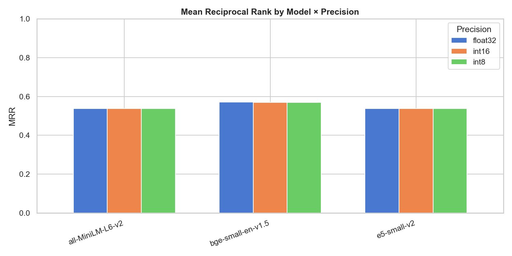
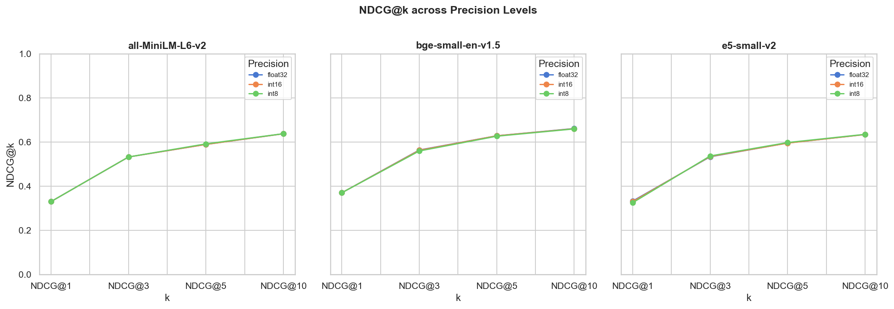
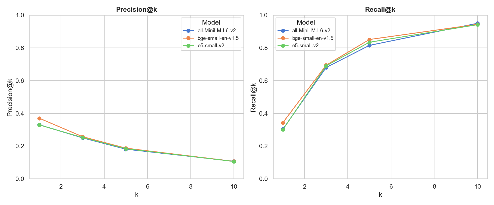
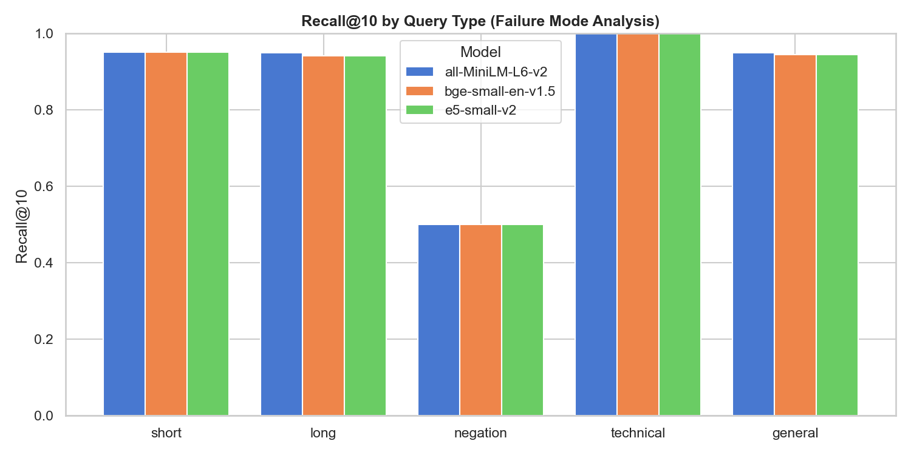

# Retrieval Lies: Benchmarking Endee Vector Database

## Overview
This benchmark evaluates [Endee](https://endee.io) across **18** index configurations,
combining **3 embedding models** × **6 index configs**
on **200 MS MARCO queries** against a corpus of 25,000 passages.

**Key question:** How much does your choice of embedding model, quantization precision,
and HNSW construction parameters actually affect retrieval quality?

---

## Results Summary

| model             | precision   |   ef_con |    MRR |   P@10 |   R@10 |   NDCG@10 |
|:------------------|:------------|---------:|-------:|-------:|-------:|----------:|
| bge-small-en-v1.5 | float32     |      128 | 0.5709 | 0.1065 | 0.945  |    0.661  |
| bge-small-en-v1.5 | float32     |       64 | 0.5709 | 0.1065 | 0.945  |    0.6609 |
| bge-small-en-v1.5 | int16       |       64 | 0.5705 | 0.1065 | 0.945  |    0.6607 |
| bge-small-en-v1.5 | int16       |      128 | 0.5704 | 0.106  | 0.94   |    0.6596 |
| bge-small-en-v1.5 | int8        |       64 | 0.5696 | 0.1065 | 0.945  |    0.6599 |
| bge-small-en-v1.5 | int8        |      128 | 0.5692 | 0.106  | 0.9425 |    0.6584 |
| e5-small-v2       | float32     |      128 | 0.541  | 0.106  | 0.9425 |    0.6362 |
| e5-small-v2       | int16       |      128 | 0.5393 | 0.1065 | 0.9475 |    0.636  |
| e5-small-v2       | int8        |      128 | 0.5387 | 0.106  | 0.9425 |    0.6353 |
| all-MiniLM-L6-v2  | int8        |       64 | 0.538  | 0.107  | 0.95   |    0.6379 |
| all-MiniLM-L6-v2  | int16       |       64 | 0.5377 | 0.107  | 0.95   |    0.6375 |
| all-MiniLM-L6-v2  | float32     |       64 | 0.5377 | 0.107  | 0.95   |    0.6375 |
| e5-small-v2       | int8        |       64 | 0.5373 | 0.106  | 0.9425 |    0.6341 |
| e5-small-v2       | int16       |       64 | 0.5372 | 0.105  | 0.9358 |    0.6314 |
| all-MiniLM-L6-v2  | int8        |      128 | 0.5371 | 0.107  | 0.95   |    0.6372 |
| all-MiniLM-L6-v2  | float32     |      128 | 0.5368 | 0.107  | 0.95   |    0.637  |
| all-MiniLM-L6-v2  | int16       |      128 | 0.5368 | 0.107  | 0.95   |    0.637  |
| e5-small-v2       | float32     |       64 | 0.5363 | 0.1055 | 0.9375 |    0.6312 |

---

## Key Findings

### Best Configuration
- **Model:** `bge-small-en-v1.5`
- **Precision:** `float32`
- **EF Construction:** `128`
- **MRR:** `0.5709` | **NDCG@10:** `0.6610`

### Worst Configuration
- **Model:** `e5-small-v2`
- **Precision:** `float32`
- **EF Construction:** `64`
- **MRR:** `0.5363` | **NDCG@10:** `0.6312`

### Precision Impact
The gap between `float32` and `int8` quantization across all models
shows the real cost of aggressive compression on retrieval quality.

---

## Charts

### MRR by Model × Precision

### NDCG@k Curves

### Precision & Recall @k

### Failure Mode Analysis

---

## Methodology

- **Dataset:** MS MARCO Passage Ranking (25,000 passages, 200 queries with ground truth)
- **Embedding models:** `all-MiniLM-L6-v2`, `BAAI/bge-small-en-v1.5`, `intfloat/e5-small-v2`
- **Index configs:** precision ∈ {float32, int16, int8} × ef_con ∈ {64, 128}
- **Metrics:** Precision@k, Recall@k, MRR, NDCG@k for k ∈ {1, 3, 5, 10}
- **Hardware:** NVIDIA RTX 4060, Ryzen 5 7600X
- **Vector DB:** Endee (Docker, local)

---

*Generated by [retrieval-lies](https://github.com/YOUR_USERNAME/retrieval-lies)*
